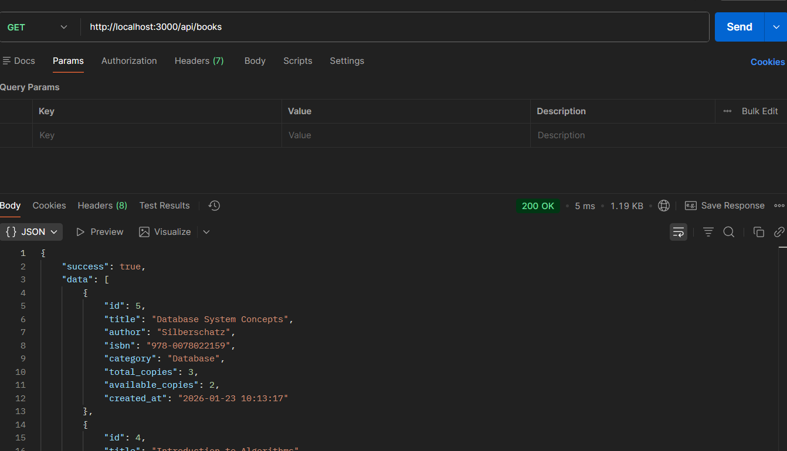
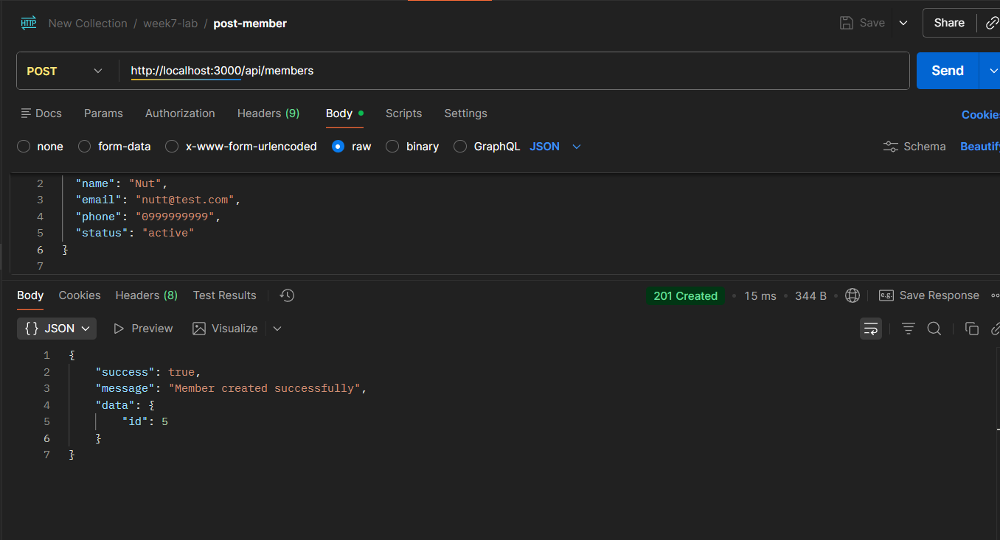
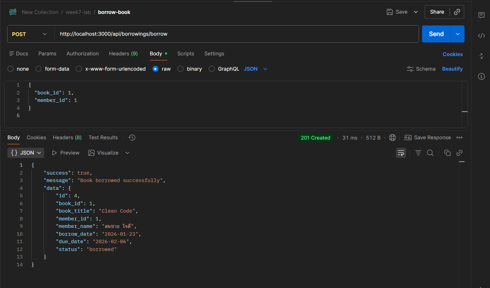
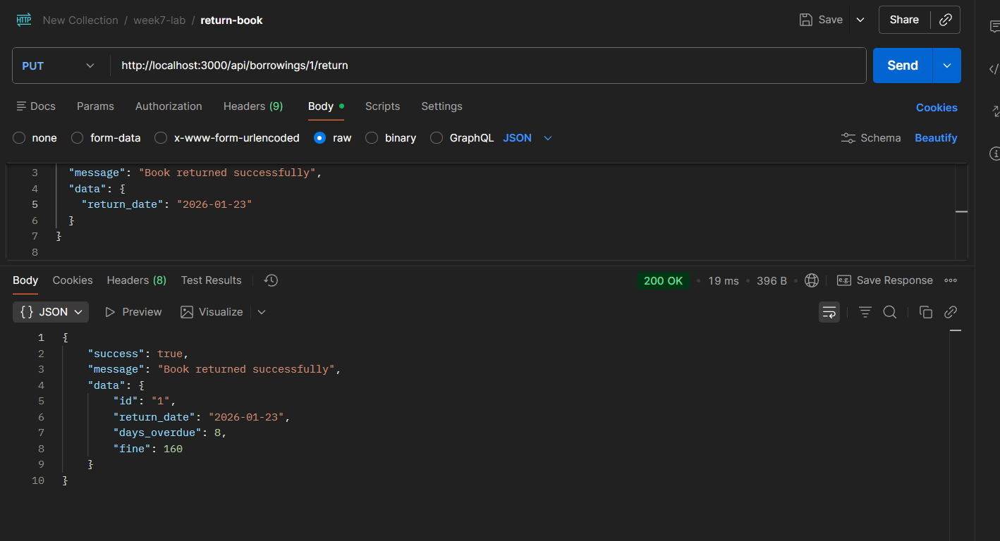
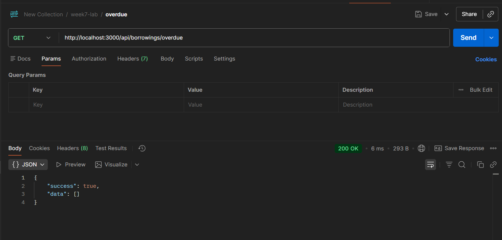

# 📚 ENGCE301 - Week 7 Lab Assignment

## Library Management System API

RESTful API สำหรับระบบจัดการห้องสมุด\
พัฒนาโดยใช้ **Node.js + Express + SQLite** และออกแบบตาม **Layered
Architecture (4 Layers)**

------------------------------------------------------------------------

## 👤 ผู้จัดทำ

-   ชื่อ: Natthakit Yangyuenpiyarat
-   รหัสนักศึกษา: 66543206014-3
-   รายวิชา: ENGCE301 Software Design and Development

------------------------------------------------------------------------

## 🏗️ Architecture

โปรเจกต์นี้ใช้โครงสร้างแบบ **4 Layers**

    Client (Postman)
       ↓
    Routes (Routing Layer)
       ↓
    Controllers (Controller Layer)
       ↓
    Services (Business Logic Layer)
       ↓
    Database (Database Layer - SQLite)

------------------------------------------------------------------------

## 📂 Project Structure

    engce301-week7-lab/
    ├── database/
    │   ├── connection.js
    │   ├── schema.sql
    │   ├── init-db.js
    │   ├── books.db.js
    │   ├── members.db.js
    │   └── borrowings.db.js
    ├── services/
    │   ├── book.service.js
    │   ├── member.service.js
    │   └── borrowing.service.js
    ├── controllers/
    │   ├── book.controller.js
    │   ├── member.controller.js
    │   └── borrowing.controller.js
    ├── routes/
    │   ├── books.route.js
    │   ├── members.route.js
    │   └── borrowings.route.js
    ├── screenshots/
    │   ├── get-books.png
    │   ├── post-member.png
    │   ├── borrow-book.png
    │   ├── return-book.png
    │   └── overdue.png
    ├── postman/
    │   └── Library_API.postman_collection.json
    ├── server.js
    ├── package.json
    └── README.md

------------------------------------------------------------------------


## 🗄️ Database Design

### Tables

#### 1. books

-   id (PK)
-   title
-   author
-   isbn
-   category
-   total_copies
-   available_copies
-   created_at

#### 2. members

-   id (PK)
-   name
-   email
-   phone
-   membership_date
-   status

#### 3. borrowings

-   id (PK)
-   book_id (FK)
-   member_id (FK)
-   borrow_date
-   due_date
-   return_date
-   status

มีการใช้: - Foreign Keys - CHECK Constraints - Indexes - Sample Data

------------------------------------------------------------------------

## 🌐 API Endpoints

### Books

  Method   Endpoint               Description
  -------- ---------------------- ----------------
  GET      /api/books             Get all books
  GET      /api/books/:id         Get book by id
  GET      /api/books/search?q=   Search books
  POST     /api/books             Create book
  PUT      /api/books/:id         Update book

### Members

  Method   Endpoint           Description
  -------- ------------------ ------------------
  GET      /api/members       Get all members
  GET      /api/members/:id   Get member by id
  POST     /api/members       Create member
  PUT      /api/members/:id   Update member

### Borrowings

  Method   Endpoint                     Description
  -------- ---------------------------- -----------------------
  GET      /api/borrowings              Get all borrowings
  GET      /api/borrowings/:id          Get borrowing by id
  GET      /api/borrowings/member/:id   Get member borrowings
  POST     /api/borrowings/borrow       Borrow book
  PUT      /api/borrowings/:id/return   Return book
  GET      /api/borrowings/overdue      Get overdue

------------------------------------------------------------------------

## 🧠 Business Logic

### Borrow Book

-   หนังสือต้องมีเล่มว่าง
-   สมาชิกต้อง status = active
-   ยืมได้ไม่เกิน 3 เล่ม
-   ระยะเวลายืม 14 วัน
-   available_copies ลด 1

### Return Book

-   บันทึก return_date
-   เปลี่ยน status เป็น returned
-   available_copies เพิ่ม 1
-   คิดค่าปรับ 20 บาท/วัน หากเกินกำหนด

------------------------------------------------------------------------

## 🧪 Testing (Postman)

ทดสอบทุก endpoint ด้วย Postman

### Example Test Cases

#### 1. Get Books

    GET http://localhost:3000/api/books

#### 2. Create Member

    POST http://localhost:3000/api/members

Body:

``` json
{
  "name": "Nut",
  "email": "nut@test.com",
  "phone": "0999999999",
  "status": "active"
}
```

#### 3. Borrow Book

    POST http://localhost:3000/api/borrowings/borrow

``` json
{
  "book_id": 1,
  "member_id": 1
}
```

#### 4. Return Book

    PUT http://localhost:3000/api/borrowings/1/return

#### 5. Overdue

    GET http://localhost:3000/api/borrowings/overdue

------------------------------------------------------------------------

## 📸 Screenshots

### GET /api/books


### POST /api/members


### Borrow Book


### Return Book


### Overdue



------------------------------------------------------------------------

## ✅ Features Summary

-   RESTful API ครบตามโจทย์
-   Layered Architecture ชัดเจน
-   Business Logic ถูกต้อง
-   Error Handling ครบ
-   ใช้ SQLite + Foreign Key
-   ทดสอบด้วย Postman
-   มี Documentation ครบถ้วน

------------------------------------------------------------------------

## 🎯 Conclusion

โปรเจกต์นี้แสดงการออกแบบระบบ API แบบครบวงจร\
ตั้งแต่ Database → Business Logic → API → Testing\
เหมาะสำหรับระบบขนาดเล็กถึงกลาง และสามารถต่อยอดเป็นระบบจริงได้

------------------------------------------------------------------------

**ENGCE301 - Software Design and Development**\
**Week 7 Lab Assignment**
